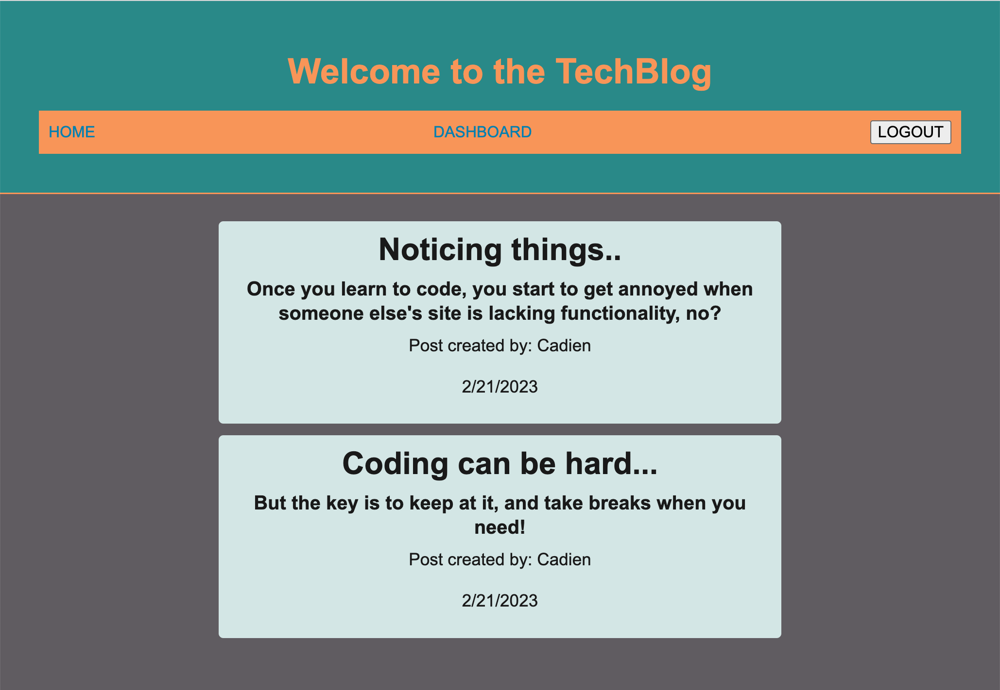

# Tech Blog

This is a full-stack application using Model-View-Controller (MVC) programming to provide users the ability to make (and delete) blog posts and comment on them.

## Table of Contents

- [Features](#features)
- [Installation](#installation)
- [screenshot](#screenshot)
- [Live Website](#live-websites)
- [Technologies](#technologies)
- [Acknowledgements](#acknowledgements)
- [License](#License)

## Features

- Functionality to post, update, and delete content.
- Functionality to sign in or sign-up with a username and password.
- Timestamps on posts and comments.

## Installation

Install package.json dependencies.

- Run "npm i"

Connect connection.js script to your local SQL database editor.

- Modify database password line in .env file with that of your local SQL database editor.

Create database tables:

- Run schema.sql in your local SQL database editor.

- Seed SQL database editor
  - Run "node run seed"

Execute the program:

- Run "npm start"

## Screenshot

## Live Website

[_Website_](https://tech-blog-clj.herokuapp.com/post/1)

## Technologies

- JavaScript
- JQuery
- MySQL
- Node.js
- Express
- Sequelize
- Handlebars
- BCrypt
- JawsDb
- Heroku
- DotEnv

## Acknowledgements

- This website was built with help from instructors and classmates during office hours of our bootcamp. Thanks, as always!

## License

[MIT](https://choosealicense.com/licenses/mit/)
